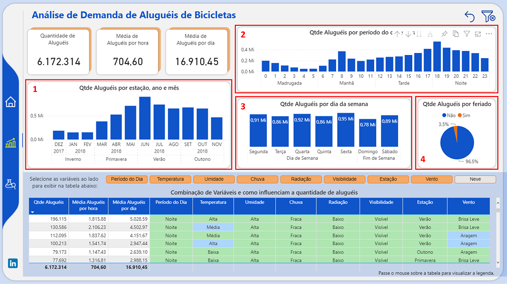
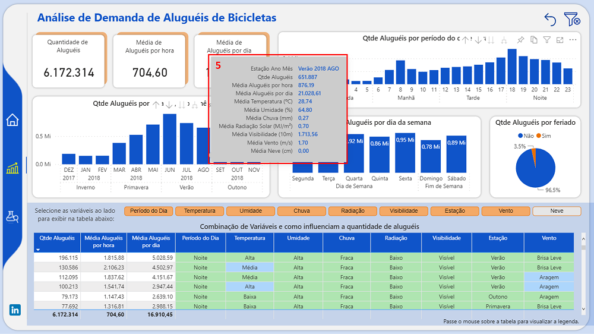

# Demanda de Aluguéis de Bicicleta 

## **Introdução do Problema** 

Qualquer empresa com fins lucrativos precisa traçar estratégias para aumentar a demanda de seu serviço. E a melhor forma de fazer isso é analisando os dados para uma tomada de decisão baseada em fatos e dados. E o case apresentado elucida como podemos fazer isso através da construção de um dashboard. 

**Problema**: Determinada cidade tem investido em ciclovias e a empresa em questão, que oferece serviço de aluguel de bicicletas e tem diversos pontos de aluguéis espalhados nesta cidade, possui como objetivo aumentar o número de bicicletas alugadas. 

**Objetivo do Dashboard**: Ajudar na compreensão do negócio extraindo informações relevantes e a despertar ideias e insights que contribuam na elaboração de estratégias para aumentar as vendas do serviço de aluguel de bicicletas desta empresa. 

**Dataset**: Dados foram extraídos do Kaggle: https://www.kaggle.com/code/hardikjain10/seoul-bike-rented/data

**Dicionário de Dados**: Abaixo segue uma descrição das variáveis utilizadas para a construção do dashboard.

➔ Date (data): data  
➔ Rented Bike Count (aluguel): Contagem de bicicletas alugadas  
➔ Hour (hora): horário do dia  
➔ Temperature(°C) (temperatura): temperatura em ºC  
➔ Humidity(%) (umidade): Umidade(%)  
➔ Wind speed (m/s) (vento): Velocidade do vento (m/s)  
➔ Visibility (10m) (visibilidade): Visibilidade (10m)  
➔ Dew point temperature(°C) (temp_orvalho): Temperatura do ponto de orvalho (°C)  
➔ Solar Radiation (MJ/m2) (radiacao_solar): Radiação Solar (MJ/m2)  
➔ Rainfall (mm) (precipitacao_pluviometrica): Precipitação Pluviométrica(mm)  
➔ Snowfall (cm) (neve): Queda de neve (cm)  
➔ Seasons (estacao): estação do ano  
➔ Holiday (feriado): se o dia era um feriado  
➔ Functioning Day (dia_util): se o dia era útil ou não  

## **Desenvolvimento**

Um dos fatores que influencia a demanda de aluguéis de bicicleta é a condição climática. E o conjunto de dados analisado traz exatamente isso: quais eram as diversas condições climáticas (como temperatura, chuva, umidade, entre outros) em cada hora do dia e a quantidade de bicicletas alugadas nesse horário. 

Na Página Inicial (imagem acima), podemos ver uma breve descrição do problema, o período de dados e a fonte de dados utilizada. 

Na "Análise de Demanda de Aluguéis de Bicicletas", podemos analisar as diversas variáveis do conjunto de dados e como elas se relacionam com o volume de bicicletas alugadas e influenciam o aumento ou não de aluguéis.  
1. No visual "Qtde Aluguéis por estação, ano e mês", podemos constar que o maior volume de aluguéis ocorreu nos períodos mais quentes.  
2. E em "Qtde Aluguéis por período do dia e horário", o maior volume ocorreu no começo do dia e no final da tarde e à noite.  
3. Não vemos uma grande diferença em relação ao volume de aluguéis nos dias da semana em "Qtde Aulguéis por dia da semana".  
4. E a maioria da quantidade de aluguéis ocorreram em dias que não eram feriados, mas isso não impede que alguma ação também seja realizada nos feriados. 
5. A tabela mostra como as diversas variáveis como as condições climáticas influenciam na demanda de aluguéis de bicicletas e como suas combinações podem trazer insights para elaborar estratégias que leve ao aumento da demanda do serviço.

6. 

## **Conclusão e Insights**

## **Próximos Passos**

**Para acessar e navegar pelo dashboard no Power BI**, clique [aqui].( link )

