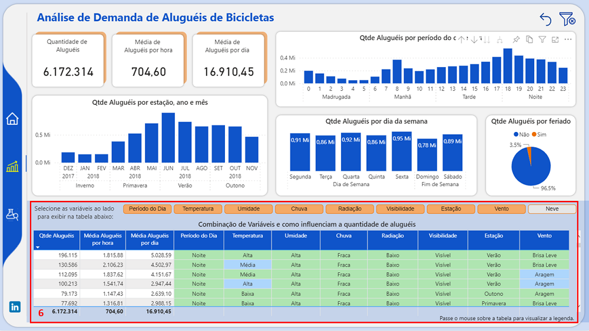
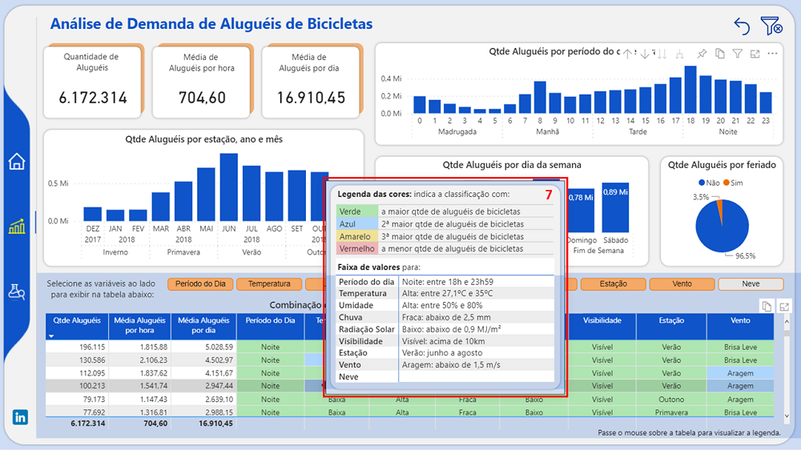
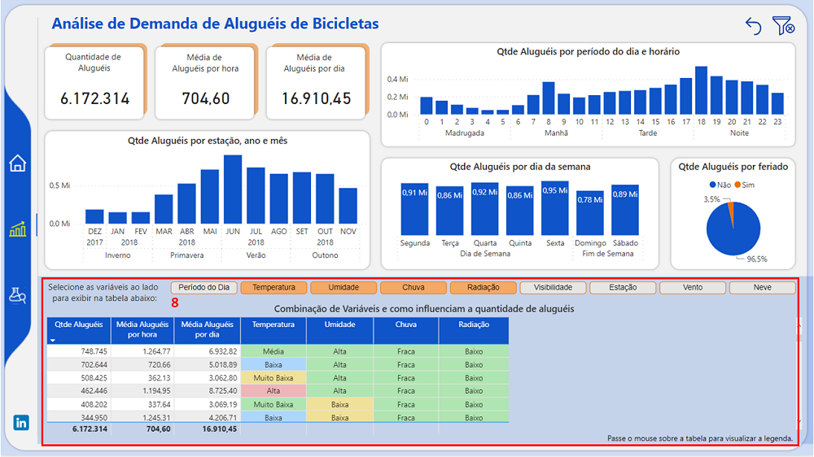
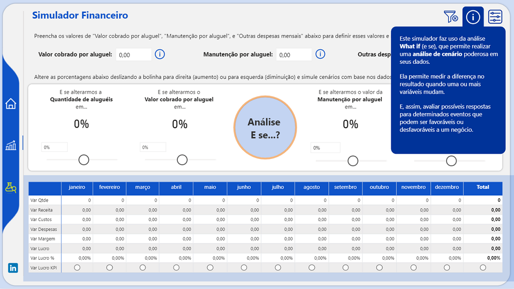
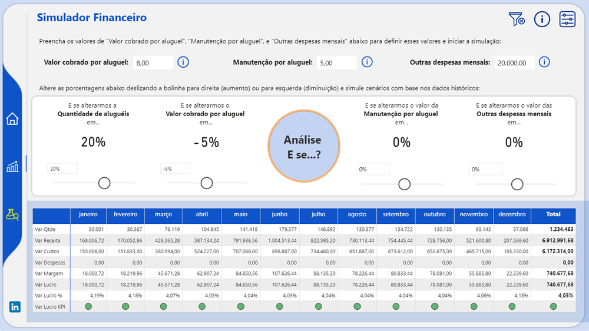

# Demanda de Aluguéis de Bicicleta 

## **Introdução do Problema** 

Qualquer empresa com fins lucrativos precisa traçar estratégias para aumentar a demanda de seu serviço. E a melhor forma de fazer isso é analisando os dados para uma tomada de decisão baseada em fatos e dados. E o case apresentado elucida como podemos fazer isso através da construção de um dashboard. 

**Problema**: Determinada cidade tem investido em ciclovias e a empresa em questão, que oferece serviço de aluguel de bicicletas e tem diversos pontos de aluguéis espalhados nesta cidade, possui como objetivo aumentar o número de bicicletas alugadas. 

**Objetivo do Dashboard**: Ajudar na compreensão do negócio extraindo informações relevantes e a despertar ideias e insights que contribuam na elaboração de estratégias para aumentar as vendas do serviço de aluguel de bicicletas desta empresa. 

**Dataset**: Dados foram extraídos do Kaggle: https://www.kaggle.com/code/hardikjain10/seoul-bike-rented/data

**Dicionário de Dados**: Abaixo segue uma descrição das variáveis utilizadas para a construção do dashboard.

➔ Date (data): data  
➔ Rented Bike Count (aluguel): Contagem de bicicletas alugadas  
➔ Hour (hora): horário do dia  
➔ Temperature(°C) (temperatura): temperatura em ºC  
➔ Humidity(%) (umidade): Umidade(%)  
➔ Wind speed (m/s) (vento): Velocidade do vento (m/s)  
➔ Visibility (10m) (visibilidade): Visibilidade (10m)  
➔ Dew point temperature(°C) (temp_orvalho): Temperatura do ponto de orvalho (°C)  
➔ Solar Radiation (MJ/m2) (radiacao_solar): Radiação Solar (MJ/m2)  
➔ Rainfall (mm) (precipitacao_pluviometrica): Precipitação Pluviométrica(mm)  
➔ Snowfall (cm) (neve): Queda de neve (cm)  
➔ Seasons (estacao): estação do ano  
➔ Holiday (feriado): se o dia era um feriado  
➔ Functioning Day (dia_util): se o dia era útil ou não  

## **Desenvolvimento**

Um dos fatores que influencia a demanda de aluguéis de bicicleta é a condição climática. E o conjunto de dados analisado traz exatamente isso: quais eram as diversas condições climáticas (como temperatura, chuva, umidade, entre outros) em cada hora do dia e a quantidade de bicicletas alugadas nesse horário. 

Levando em consideração essa primeira análise, comecei a explorar os dados e suas diversas variáveis montando um primeiro relatório ("Análise de Demanda de Aluguéis de Bicicletas") e, assim, verificar o relacionamento entre as variáveis e a quantidade de aluguéis. Posteriormente, elaborei um "Simulador Financeiro" para auxiliar na análise de diversos cenários e na avaliação de possíveis respostas para determinados eventos. 

Figura 1

Na **Página Inicial** (Figura 1), podemos ver uma breve descrição do problema, o período de dados e a fonte de dados utilizada. 

Figura 2

Na **"Análise de Demanda de Aluguéis de Bicicletas"** (Figura 2), podemos analisar as diversas variáveis do conjunto de dados, como elas se relacionam com o volume de bicicletas alugadas e como influenciam o aumento ou não de aluguéis. 
1. No visual **"Qtde Aluguéis por estação, ano e mês"**, podemos constar que o maior volume de aluguéis ocorreu nos períodos mais quentes. Notamos também como os volumes são diferentes em cada estação, sendo portanto um grande indicativo de ser uma variável relevante para o volume de aluguéis. 
2. Em **"Qtde Aluguéis por período do dia e horário"**, o maior volume ocorreu no começo do dia e no final da tarde e à noite, sendo o horário outra variável importante para o aumento de aluguéis. 
3. Não vemos uma grande diferença em relação ao volume de aluguéis nos dias da semana em **"Qtde Aluguéis por dia da semana"**. 
4. E a maioria da quantidade de aluguéis ocorreram em dias que não eram **feriados**, mas isso não impede que alguma ação também seja realizada nos feriados. 

Figura 3

5. E no tooltip (dica de ferramenta) dos visuais "Qtde Aluguéis por estação, ano e mês" e "Qtde Aluguéis por período do dia e horário" (Figura 3) podemos acompanhar as médias de temperatura, umidade, chuva, etc.

Figura 4

6. Partindo para analisar as condições climáticas (Figura 4), resolvi criar faixas de valores para facilitar a análise da influência de cada situação no volume de aluguéis. A tabela mostra, portanto, como as diversas variáveis como as condições climáticas influenciam na demanda de aluguéis de bicicletas e como suas combinações podem trazer insights para elaborar estratégias que leve ao aumento da demanda do serviço.

Figura 5

7. E no tooltip da tabela (Figura 5), trago as informações referentes às faixas de valores apresentadas, assim como legenda das cores utilizadas.  
Todo o tratamento para definir as faixas de valores foi realizada no Power Query Editor. 

Figura 6

8. Podemos então combinar as variáveis de diversas maneiras e ordem para analisarmos quais os fatores que mais influenciam a quantidade de aluguéis de bicicletas, como por exemplo na imagem vemos temperatura média, umidade alta, chuva fraca e radiação baixa. 

Figura 7

No **Simulador Financeiro**, a ideia é possibilitar a análise "What If" (E se) simulando diversos cenários financeiros para extrair insights baseado em dados históricos. 

Para iniciar, adicione o valor cobrado por aluguel, o valor de manutenção por aluguel e o valor das outras despesas mensais. 
A partir daí, as possibilidades das simulações baseiam-se na alteração percentual da(o):
* Quantidade de aluguéis 
* Valor cobrado por aluguel 
* Manutenção por aluguel
* Outras despesas mensais 

E o resultado pode ser conferido na tabela logo abaixo, onde visualizamos as variações positivas ou negativas da simulação. 

Figura 8

**Exemplo de Simulação**: vamos supor que queiramos dar um desconto de 5% no valor cobrado no aluguel. Para suprir esse desconto, podemos vender mais, cortar despesas ou aumentar o custo de manutenção. 
Escolhendo vender mais, precisamos aumentar a quantidade de aluguéis em, no mínimo, 20% para começar a ter algum lucro. 

## **Conclusão e Insights**

## **Próximos Passos**

**Para acessar e navegar pelo dashboard no Power BI**, clique [aqui].( link )

